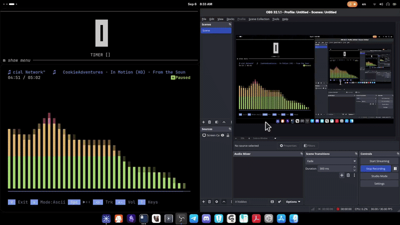
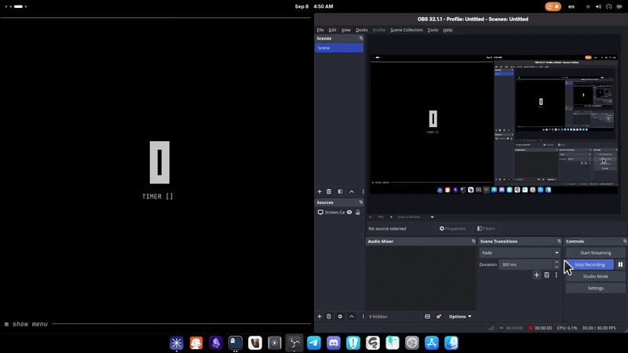
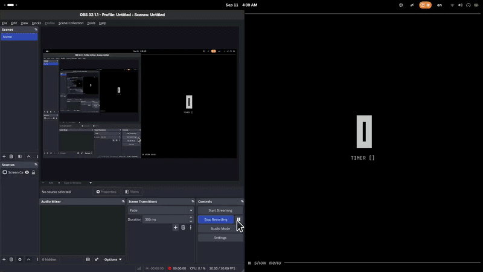
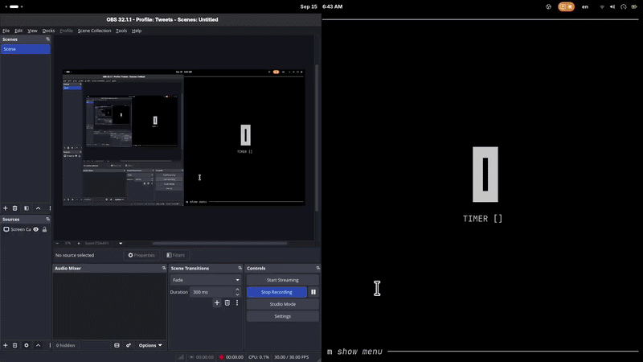

# httpfromtcp

**HTTP/1.1** from raw TCP in Go.

An HTTP/1.1 server built directly on TCP sockets — no `net/http` for serving. A raw listener accepts connections, an incremental parser turns the byte stream into a request (request-line → headers → `Content-Length` body), and a stateful writer serializes responses (status line / headers / body, plus chunked encoding with trailers). A small demo server wires it together with hardcoded handlers. The logic lives in library-shaped `internal/` packages, with thin `cmd/` binaries on top.

## Proof of work

Time-lapse recordings of the build sessions, in order:


*Session — day 20*


*Session — days 21–22*


*Session — days 23–25*


*Session — days 26–28*

(`assets/vim.mp4` is not part of the proof — it's the video file served by `GET /video`.)

## Outline

```
.
├── cmd/
│   ├── httpserver/       # demo HTTP server: routes, proxy, graceful shutdown
│   ├── tcpDialer/        # raw TCP client: dials 127.0.0.1:42069, sends one hardcoded GET
│   └── tcplistener/      # TCP listener that parses requests and prints them
├── internal/
│   ├── constants/        # shared constants (CRLF)
│   ├── headers/          # header map: parse, Get/Set/UnSet/Add, duplicate merging (+ tests)
│   ├── request/          # incremental request parser: request-line, headers, body (+ tests)
│   ├── response/         # response writer: status line, headers, body, chunked, trailers
│   └── server/           # listener: Serve/Close, one goroutine per connection
├── assets/               # work-session GIFs + vim.mp4 (served by /video)
├── go.mod
└── go.sum
```

## What it provides

### Request parsing — `internal/request`, `internal/headers`

- A state-machine parser walking `parsingRequestLine → parsingFieldLines → parsingMessageBody → done` over its own 4096-byte buffer, which grows when a request outruns it.
- Correctness is independent of how the bytes arrive: reads of 1 byte and reads of 900 bytes yield the same request. The tests drive exactly this with a `chunkReader` that caps bytes-per-read.
- Request-line validation: exactly three space-separated tokens, an all-uppercase method, a target starting with `/`, and version `HTTP/1.1` (normalized to `1.1`).
- A headers map with `Get` / `Set` / `Add` / `UnSet`: keys lowercased, values trimmed, field-name characters validated against the token set, and repeated field lines merged into one comma-joined value rather than clobbering each other.
- Body handling driven strictly by `Content-Length`: exactly N bytes land in `Request.Body`, and a short *or* long body is an error. `Content-Length: 0` and a missing `Content-Length` both mean "no body".

### Response writing — `internal/response`

- `Writer` is also a state machine (`writingStatusLine → writingFieldLines → writingBody → writingTrailers → finished`) that rejects out-of-order calls with an explicit error instead of emitting malformed bytes.
- Status-line generation for the three codes it knows: `200 OK`, `400 Bad Request`, `500 Internal Server Error`.
- Header serialization, plus a plain content-length body write.
- Chunked transfer-encoding: `WriteChunkedBody` frames chunks as hex-length + CRLF-delimited payloads, `WriteChunkedBodyDone` writes the terminating `0\r\n`, and `WriteTrailers` emits only the names announced in the `Trailer` header.
- `GetDefaultHeaders` is a convenience the handler calls and then edits: it seeds `Content-Length`, `Connection: close`, `Content-Type: text/plain`, and handlers override or `UnSet` whatever they don't need — the proxy drops `Content-Length` and switches to `Transfer-Encoding: chunked`, the video handler swaps in `video/mp4`. `WriteClientError` / `WriteServerError` render any `error` as a 400/500 body.

### Connection handling — `internal/server`

- `Serve(handler, port)` returns a `*Server` immediately and accepts in a background goroutine; `Close()` stops the listener. Liveness lives in an `atomic.Bool`.
- Each accepted connection gets its own goroutine: wrap the socket in a `response.Writer`, parse one request, hand both to the handler.
- The entire app-level seam is `func(*response.Writer, *request.Request)` — no interface to satisfy, no context, no middleware chain.

### Demo server — `cmd/httpserver`

- A routing `switch` with sub-handlers, the streaming `/httpbin` proxy (1 KiB reads → chunks → sha256/length trailers), and SIGINT/SIGTERM shutdown.
- `cmd/tcplistener` doubles as a debugging harness: it prints the parsed request line, every header, and the body, so you can watch the parser handle real traffic from `curl`.

## Entry points

- **`cmd/httpserver`** — the main demo. Calls `server.Serve(Handler, 42069)`, blocks on SIGINT/SIGTERM, then closes the server.
- **`cmd/tcplistener`** — accepts on `127.0.0.1:42069`, parses each connection with `request.RequestFromReader`, prints the request line, headers, and body.
- **`cmd/tcpDialer`** — dials `127.0.0.1:42069` and writes one fixed `GET /` request.
- **Library surface:**
  - `server.Serve(handler Handler, port int) (*Server, error)` / `(*Server).Close() error`
  - `request.RequestFromReader(io.Reader) (*Request, error)`
  - `response.Writer` — `WriteStatusLine`, `WriteHeaders`, `WriteBody`, `WriteChunkedBody`, `WriteChunkedBodyDone`, `WriteTrailers`

## How to run

```sh
go run ./cmd/httpserver
```

The server listens on port **42069** (const in `cmd/httpserver/main.go`).

Note: `/video` reads `assets/vim.mp4` via a relative path (`os.ReadFile`), so run the server from the repo root or the request will 500.

## Quick test endpoints

Routes from `Handler` in `cmd/httpserver/main.go`:

| Route | Response |
| --- | --- |
| `GET /` (and any unlisted path) | `200` HTML |
| `GET /yourproblem` | `400` HTML |
| `GET /myproblem` | `500` HTML |
| `GET /video` | `video/mp4` from `assets/vim.mp4` |
| `GET /httpbin/...` | proxy to `https://httpbingo.org/...`, chunked + trailers |

```sh
# 200 HTML
curl -v http://localhost:42069/

# 400 HTML
curl -v http://localhost:42069/yourproblem

# 500 HTML
curl -v http://localhost:42069/myproblem

# video/mp4 — saved as vim.mp4
curl -v -o vim.mp4 http://localhost:42069/video

# chunked proxy — chunks visible on the wire with --raw,
# trailers X-Content-SHA256 and X-Content-Length at the end
curl -v --raw http://localhost:42069/httpbin/uuid
```

## Limitations

- **One request per connection.** The server parses a single request, runs the handler, then closes the socket — no keep-alive, no pipelining.
- **Origin-form targets only.** Absolute-form (`GET http://host/path`) and `OPTIONS *` are rejected by the target validator.
- **Header order on the wire isn't deterministic** — headers are a `map[string]string` iterated at write time.
- **No multi-value headers.** Repeated field lines collapse into one comma-joined string.
- **`Content-Length` must be numeric.** A body shorter or longer than the declared length is a parse error.
- **No connection deadlines.** A stalled client holds its goroutine open, and there's no `recover`, so a handler panic takes the process down.
- **`Serve` binds `:<port>`** (all interfaces), and `Close()` stops accepting without draining in-flight connections.
- **The proxy buffers the full upstream body** to compute the `X-Content-SHA256` trailer, and writes `200` before reading upstream — so the upstream status is never forwarded (`/httpbin/status/404` returns `200`). The upstream host is hardcoded to `httpbingo.org` and matched by prefix, so `/httpbinxyz` also routes to the proxy.

## Notes

- Tests live next to the packages they cover: `internal/headers` (field-line parsing, duplicate merging, invalid names) and `internal/request` (request line, headers, and body lengths across varying read sizes), using `stretchr/testify`.

```sh
go test ./...
```
